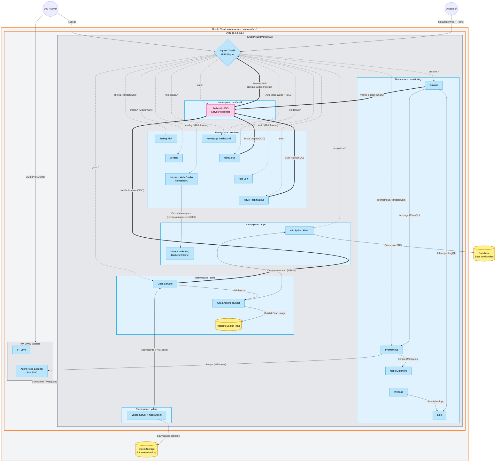

# k3s-oracle
Projet perso d'un kube hébergé via le free tier oracle 

# Services disponibles 
- [NextCloud](https://nextcloud.quick-shift.fr/)
- [Controle de poste à distance (Python Flask)](https://api-python.quick-shift.fr/)
- [Gitea](https://gitea.quick-shift.fr/)
- [Grafana](https://grafana.quick-shift.fr/)
- [Prometheus](https://prometheus.quick-shift.fr/)
- [Homepage](https://homepage.quick-shift.fr/)

# Architecture


# Construction du projet
## Création free tier oracle
- Création du compte oracle
- Choix de la région Franckfurt afin de bénéficier du free tier et d'être proche géographiquement. 
- Configuration de l'OTP. 
- Création d'une Budget Alert pour être alerté si le budget risque de dépasser 1€ à la fin du mois. 
- Création de token API : 
    ```
    [DEFAULT]
    user=ocid1.user.oc1..aaaaaaaata6ps4e3t4nucggkk4y4e724heuzdx77ytn574u5wkwghrvyuq5a
    fingerprint=32:b6:3f:cb:63:f7:c6:d2:be:cd:25:eb:a7:d7:0b:b7
    tenancy=ocid1.tenancy.oc1..aaaaaaaapnqysihgyhcllziuu7grydz5uptzrge4arslvsevjpokubwr72sa
    region=eu-frankfurt-1
    key_file=<path to your private keyfile> # TODO
    ```

## Terraform 
- Création des variables 
- Création du network avec :
    - Un VCN : réseau privé virtuel de base.
    - Une Internet Gateway : pour que le VCN puisse communiquer avec internet.
    - Une Route Table 
    - Une Security List (Pare-feu) : autorise SSH (22), HTTP (80), HTTPS (443), WireGuard (51820 UDP) et trafic interne entre VMs
    - Un Subnet public : zone pour le VMs dans le VCN 
- Création clé ssh et mise dans variables 
- Création du compute : 
    - VM bastion/vpn (AMD)
    - VM k3s (AMD)
    - VM worker k3s (AMD) 
    (la création des AMD est à relancer plusieurs fois dû à l'erreur Out of host capacity)
- Création du bucket S3 pour les sauvegardes, d'un groupe et d'un user de service pour Velero, de la policy pour autoriser ce groupe à écrire dans le S3 et les clés S3. 

## VPN
- Connexion SSH : `ssh -i ~/.ssh/id_ed25519_oracle ubuntu@xxx` 
- Mise à jours des paquets
- Installation de WireGuard via script d'installation : 
    - download de angristan/wireguard-install
    - lancement du script -> création de la conf wireguard
- Sur windows, installation de wireguard et injection de la conf (voir [la documentation du VPN](./doc_VPN.md))
- Un fichier [.ssh/config](./.ssh/config) est disponible pour faciliter les connexions ssh


## VM k3s
- Connexion au WireGuard
- Connexion à la VM Master `ssh -i ~/.ssh/id_ed25519_oracle ubuntu@xxx`
- Installation de k3S : `curl -sfL https://get.k3s.io | sh -`
- Récupération token kube du Master : sudo cat /var/lib/rancher/k3s/server/node-token
- Ouvir les flux (sur Worker et Master) : 
    ```
    sudo iptables -I INPUT 1 -s 10.0.1.0/24 -j ACCEPT
    sudo netfilter-persistent save
    ```
- Sur le Worker : 
    ```
    ssh -i ~/.ssh/id_ed25519_oracle ubuntu@10.0.1.xx
    curl -sfL https://get.k3s.io | K3S_URL=https://10.0.1.xx:6443 K3S_TOKEN="<TOKEN>" sh -
    sudo systemctl restart k3s-agent
    ```
- Configuration de kubectl sur mon PC :
    - Récupérer conf sur le Master `sudo cat /etc/rancher/k3s/k3s.yaml`
    - En local, ajouter la configuration à ~/.kube.config. Si un fichier existe déjà, utiliser le merge de kube pour avoir un nouveau fichier config. 
> Pour vérifier, on lance un **kubectl get nodes** et on obtient bien : 
> ```text
> NAME         STATUS   ROLES           AGE   VERSION
> k3s-master   Ready    control-plane   35m   v1.34.6+k3s1
> k3s-worker   Ready    <none>          26m   v1.34.6+k3s1
> ```

## Kubernetes
- Création des namespaces **tools**, **apps**, **services** 
- Installation de Helm en local : `curl https://raw.githubusercontent.com/helm/helm/main/scripts/get-helm-3 | bash`
### NextCloud
- Ajout du repo : `helm repo add nextcloud https://nextcloud.github.io/helm/`
- Trouver paquets : `helm repo update`
- Créer secret NextCloud : 
    ```
    kubectl create secret generic nextcloud-admin-secret \
    --namespace services \
    --from-literal=username="admin" \
    --from-literal=password="xxxxx"
    ```
- Créer secret Postgre : 
    ```
    kubectl create secret generic nextcloud-pg-secret \
    --namespace services \
    --from-literal=postgres-password="xxxxx"
    ```
- Déployer NextCloud (via Helm) avec le fichier [nextcloud-values.yaml](./k3s/nextcloud/nextcloud-values.yaml) : `helm install nextcloud nextcloud/nextcloud -n services -f nextcloud-values.yaml`
- Vérifier les pods, pvc et ingress
- Ajouter `10.0.1.167    nextcloud.oracle.local` au fichier host de votre PC
- Ouvrir dans le navigateur la page web `http://nextcloud.oracle.local`
- Modif de l'host dans yaml pour utiliser `nextcloud.quick-shift.fr`
- Reapply du helm : `helm upgrade nextcloud nextcloud/nextcloud -n services -f nextcloud-values.yaml`
- Ajout du https avec tls (modif du yaml et reapply)
- Si la connexion en https ne fonctionne pas, executer ceci : 
    ```
    POD=$(kubectl get pods -n services -l app.kubernetes.io/name=nextcloud -o jsonpath='{.items[0].metadata.name}')
    kubectl exec -it $POD -n services -- su -s /bin/sh www-data -c "php occ config:system:set overwriteprotocol --value='https'"
    kubectl exec -it $POD -n services -- su -s /bin/sh www-data -c "php occ config:system:set overwritehost --value='nextcloud.quick-shift.fr'"
    kubectl exec -it $POD -n services -- su -s /bin/sh www-data -c "php occ config:system:set overwrite.cli.url --value='https://nextcloud.quick-shift.fr'"
    kubectl exec -it $POD -n services -- su -s /bin/sh www-data -c "php occ config:system:set trusted_proxies 0 --value='10.0.0.0/8'"
    kubectl exec -it $POD -n services -- su -s /bin/sh www-data -c "php occ config:system:set trusted_proxies 1 --value='10.xx.0.0/16'"
    kubectl exec -it $POD -n services -- su -s /bin/sh www-data -c "php occ config:system:set trusted_proxies 2 --value='10.xx.0.0/16'"
    ```
- Pour la connexion SSO : 
    - Dans Applications, ajouter Social Login
    - Dans Paramètres d'administration -> Connexion via Social -> Connexion OpenID personnalisée 
    - Remplir : 
        Nom interne : Authentik 
        Fonction : Authentik 
        URL d'autorisation : https://auth.quick-shift.fr/application/o/authorize/
        URL du jeton : https://auth.quick-shift.fr/application/o/token/
        Réclamation du nom d'affichage : (vide)
        URL des informations utilisateurs (optionnel) : https://auth.quick-shift.fr/application/o/userinfo/
        URL après déconnexion : (vide)
        Identifiant client : [Client ID]
        Secret client : [Client Secret]
        Portée : openid email profile
        Réclamation des groupes : groups
        Apparence du bouton : Aucun 
        Groupe par défaut : Aucun
    - Enregistrer

### CertManager
- Ajouter le catalogue : `helm repo add jetstack https://charts.jetstack.io --force-update`
- Installer CertManger : 
    ```
    helm install cert-manager jetstack/cert-manager \
    --namespace cert-manager \
    --create-namespace \
    --set crds.enabled=true
    ```
- Création de [letsencrypt-issuer.yaml](./k3s/certmanager/letsencrypt-issuer.yaml) et apply : `kubectl apply -f letsencrypt-issuer.yaml`

### Prometheus Stack 
- Créer namespace monitoring
- Ajout repo helm : `helm repo add prometheus-community https://prometheus-community.github.io/helm-charts`
- Création du [yaml](./k3s/prometheus-stack/monitoring-values.yaml)
- Créer secret admin grafana : 
    ```
    kubectl create secret generic grafana-admin-secret \
    --namespace monitoring \
    --from-literal=admin-user="admin" \
    --from-literal=admin-password="Mot_de_passe_grafana" # gitleaks:allow
    ```
- Déployer : `helm install supervision prometheus-community/kube-prometheus-stack -n monitoring -f monitoring-values.yaml`
- Ajouter la connexion SSO à Grafana : 
    - Créer le secret : 
        ```
        kubectl create secret generic grafana-oidc-secret \
        -n monitoring \
        --from-literal=client-id="CLIENT_ID" \
        --from-literal=client-secret="SECRET_COMPLEXE"
        ```
    - Appliquer le nouveau fichier values avec helm 

### Gitea
- Ajouter repo : `helm repo add gitea-charts https://dl.gitea.com/charts/`
- Secret db : 
    ```
    kubectl create secret generic gitea-pg-secret \
    --from-literal=postgres-password="xxxxxx" \
    --from-literal=password="xxxxx" \
    -n tools
    ```
- Secret admin gitea :
    ```
    kubectl create secret generic gitea-admin-secret \
    --from-literal=username="gitea_admin" \
    --from-literal=password="xxxxx" \
    -n tools
    ```
- Création du [yaml values](./k3s/gitea/gitea-values.yaml)
- Deploy du helm : `helm install gitea gitea-charts/gitea -n tools -f gitea-values.yaml`
- Sur l'UI Gitea : 
    - Dans **Administration du site**, **Actions**, **Exécuteurs** : **Créer un nouvel exécuteur**
    - Copier le token
- Créer secret : 
    ```
    apiVersion: v1
    kind: Secret
    metadata:
    name: runner-secret
    namespace: "my-gitea-namespace"
    type: Opaque
    stringData:
        runner-token: "my-cool-runner-token-given-by-gitea"
    ```
- Créer [values yaml](./k3s/gitea/runner-values.yaml) pour le runner
- Créer le runner : `helm install runner gitea-charts/actions -n tools -f runner-values.yaml`
- Ajout d'un role binding pour déploiement auto sur kube : 
    ```
    kubectl create rolebinding runner-deploy \
    --clusterrole=edit \
    --serviceaccount=tools:default \
    -n apps
    ```
- Sur le Master, récupérer /etc/rancher/k3s/k3s.yaml et remplacer https://127.0.0.1:6443 par l'IP privé du Master
- Dans le projet concerné, ajouter un secret KUBECONFIG avec ce fichier
- Pour la connexion SSO : 
    - Dans Administration du site
    - Cliquer sur Identité et Accès -> Sources d'authentification -> Ajouter une source d'authentification
    - Remplis le formulaire :
        Type d'authentification : OAuth2
        Nom de l'authentification : Authentik 
        Fournisseur OAuth2 : OpenID Connect
        ID du client (Client ID) : (Colle celui d'Authentik)
        Secret du client (Client Secret) : (Colle celui d'Authentik)
        URL de découverte automatique (OpenID Connect Auto Discovery URL) : https://auth.quick-shift.fr/application/o/gitea/.well-known/openid-configuration
        Champs d'application supplémentaires : openid email profile
    - Créer la source d'authentification 

### Python - Controle de poste à distance
- Le projet python a été réalisé dans le cadre d'un projet scolaire (IPSSI) en binome avec un camarade. Seule le dossier 'API' est à déployer sur le serveur. 
- Création des secrets Supabase : 
    ```
    kubectl create secret generic supabase-secret \
    --from-literal=SUPABASE_URL="https://jhrppxpmnkneuwqdwabl.supabase.co" \
    --from-literal=SUPABASE_PUBLISHABLE_KEY="cle_secrete" \
    -n apps
    ```
- Création des secrets groq : 
    ```
    kubectl create secret generic groq-secret \
    --from-literal=GROQ_API_KEY="token-groq" \
    -n apps
    ```
- Secret pour le registry token : 
    ```
    kubectl create secret docker-registry gitea-registry-secret \
    --docker-server=https://gitea.quick-shift.fr \
    --docker-username=gitea_admin \
    --docker-password=TOKEN \
    -n apps
    ```
- Creation du [deployment](./k3s/agent-control-python/API/api-deployment.yaml)
- apply du yaml
- Creation du [ingress](./k3s/agent-control-python/API/api-ingress.yaml)
- apply du ingress

### Loki + Promtail
- Ajouter le catalogue helm grafana : `helm repo add grafana https://grafana.github.io/helm-charts`
- Installation de Loki stack (sans grafana) : 
    ```
    helm install loki grafana/loki-stack \
    --namespace monitoring \
    --set grafana.enabled=false \
    --set prometheus.enabled=false \
    --set loki.isDefault=false \
    --set grafana.sidecar.datasources.isDefault=false
    ```
- Sur Grafana : 
  - Dans Connections -> Data sources -> Add new data source
  - Sélectionner Loki
  - Compléter l'url avec `http://loki:3100`
  - Save and Test (ne pas tenir compte de l'erreur)
  - Dans l'onglet Explore, les logs apparaissent 

### Homepage
- Création des [yaml](./k3s/homepage/homepage.yaml)
- Apply : `kubectl apply -f homepage.yaml`
- Pour ajouter un service au dashboard : 
    - modifier le ingress du service : `kubectl edit ingress gitea -n tools`
    - ajouter ces annotations : 
        ```
        gethomepage.dev/enabled: "true"
        gethomepage.dev/name: "Nom du service"
        gethomepage.dev/description: "Description du service"
        gethomepage.dev/group: "Nom du groupe"
        gethomepage.dev/icon: "nom-icon.png"
        gethomepage.dev/pod-selector: "app=app-name"
        ```
    > Les icons sont disponibles sur :
    > - https://github.com/homarr-labs/dashboard-icons/tree/main/png avec l'extension .png
    > - https://pictogrammers.com/library/mdi/ avec le préfixe mdi- et sans extension 
    > - https://simpleicons.org/ avec le préfix si- et sans extension

- Ajout du logo sur la homepage : 
    - Herberger l'image : 
        - Transformer l'image en base64 (via site web)
        - Création d'un [configmap](./k3s/homepage/logo-configmap.yaml) avec la base64
    - Mise à jour du [yaml](./k3s/homepage/homepage.yaml)
### Stirling pdf
- Création du [yaml](./k3s/stirling-pdf/stirling.yaml)
- Apply
- Se connecter avec admin et le mot de passe par défaut puis mettre à jour ce mot de passe 

### Vert (Convertisseur pdf)
- Création du [yaml](./k3s/vert/vert.yaml)
- Apply

### QRding
- Création du [yaml](./k3s/qrding/qrding.yaml)
- Apply

### Authentik 
- Créer namespace : `kubectl create namespace authentik`
- Créer le secret avec les mots des passe : 
    ```
    kubectl create secret generic authentik-pg-secret \
    -n authentik \
    --from-literal=password="MotDePassePostgresSQL" \
    --from-literal=postgres-password="MotDePasseAdminPostgresSQL"
    ```
- Génération secret key pour Authentik : 
    ```
    kubectl create secret generic authentik-core-secret \
    -n authentik \
    --from-literal=secret-key=$(openssl rand -base64 36)
    ```
- Création du fichier [values](./k3s/authentik/authentik-values.yaml)
- Ajout du repo : `helm repo add authentik https://charts.goauthentik.io`
- `helm repo update`
- Installation d'Authentik : 
    ```
    helm install authentik authentik/authentik \
    -n authentik \
    -f authentik-values.yaml
    ```
- Quand les 3 pods sont Running, aller sur https://auth.quick-shift.fr/if/flow/initial-setup/ puis compléter le mail et mot de passe pour l'admin (akadmin)
- Pour configurer des Traefik Forward Auth : 
    - Aller dans Console administrateur -> Applications -> Fournisseur -> Créer 
    - Choisir Proxy Provider, le nommé (traefik-forward-auth), mettre implicit-consent comme autorisation, sélectionner Transférer l'authentification (niveau domaine), laisser l'url par défault et mettre quick-shift.fr comme domaine, cliquer sur terminer 
    - Puis aller dans Applications -> Applications -> Créer 
    - Remplir le Name, sélectionner le fournisseur créé précédement et terminer
    - Aller dans Avant-poste, éditer celui existant, dans applications sélectionner celle qu'on a créé, Mettre à jour
    - Appliquer le [Middleware](./k3s/authentik/middleware.yaml) pour les services et pour Prometheus
    - Ajouter l'annotation `traefik.ingress.kubernetes.io/router.middlewares` dans les Ingress qu'on veut protéger 
    > `kubectl get ingress --all-namesapces` pour lister tous les ingress
- Pour les apps ayant déjà leur authentification : 
    - Aller dans Console administrateur -> Applications -> Fournisseur -> Créer
    - Créer un Fournisseur par applications avec les URLs de redirection adapté. Sélectionner le type OAuth2/OpenID Provider,  flux implicit
        | **Application** | **URI de redirection**                                                  | **Type du client** | **URI de déconnexion (optionel)**                 |
        | --------------- | ----------------------------------------------------------------------- | ------------------ | ------------------------------------------------- |
        | Gitea           | https://gitea.quick-shift.fr/user/oauth2/Authentik/callback             | Confidentiel       | https://gitea.quick-shift.fr/user/logout          |
        | NextCloud       | https://nextcloud.quick-shift.fr/apps/sociallogin/custom_oidc/Authentik | Confidentiel       | https://nextcloud.quick-shift.fr/index.php/logout |
        | Grafana         | https://grafana.quick-shift.fr/login/generic_oauth                      | Confidentiel       | https://grafana.quick-shift.fr/logout             |
        | Trek            | https://trek.quick-shift.fr/api/auth/oidc/callback                      | Confidentiel       |                                                   |

        Conserver le Client ID et le secret 
    - Créer une Application par applications. L nommer, laisser le slug automatique, sélectionner le Fournisseur correspondant. 
    - Une configuration est necessaire pour chaque application. Elle est détaillé à la fin du paragraphe de celles ci. 
- Création des groupes et authorisation (RBAC) : 
    - Dans Répertoire -> Groupes : Créer les groupes souhaités (Power Users, Guest Users)
    - Dans Applications -> Applications : Cliquer sur une application, aller dans Politique/Groupe/Liaisons utilisateur, Lier un groupe existant, sélectionner le groupe à autoriser et Créer 
- Activer la création de mot de passe autonome : 
    - Sous Personnalisation -> Plans : Créer un nouveau plan avec ce [yaml](./k3s/authentik/recovery-flow.yaml)
    - Dans Système -> Marques : éditer authentik-default et sélectionner le nouveau flow dans Flux de récupération. 
- Création de users : 
    - Dans Répertoire -> Utilisateurs : Créé un utilisateur en complétant username, nom, email
    - Dans Répertoire -> Groupes : Associer le user au groupe souhaité 
    - Dans Utilisateurs, déplier les infos du user, cliquer sur Créer un lien de récupération, transmettre ce lien à l'utilisateur. 
- Configuration SMTP : 
    - Créer secret : 
        ```
        kubectl create secret generic authentik-smtp-secret \
        --namespace authentik \
        --from-literal=smtp-password='mot_de_passe_mail_ovh'
        ```
    - Ajouter les variables env au fichier [values](./k3s/authentik/authentik-values.yaml)
    - Re deploy le helm 
    - Créer des [templates](./k3s/authentik/custom-email-template.yaml)
    - Mise à jour du values
    - Dans Authentik, acceder à Etapes -> default-recovery-email puis sélectionner le template créé et modifier le Subject
- Configuration de Marques, pour ajouter le logo, le domaine, et l'app par défaut 

### RemBG API + WebUI
- Création du [yaml](./k3s/rembg/rembg.yaml)
- Apply

### Trek
- Créer sur Authentik le provider et l'app 
- Création du [values](./k3s/trek/trek-values.yaml)
- Ajout du repo : `helm repo add trek https://mauriceboe.github.io/TREK`
- Update `helm repo update`
- Install :
    ```
    helm install --install trek -f trek-values.yaml -n services trek/trek \
    --set-string secretEnv.OIDC_CLIENT_SECRET="TON_CLIENT_SECRET_AUTHENTIK"
    ```
> Pour upgrade la chart sans écraser le secret : `helm upgrade trek -f trek-values.yaml -n services trek/trek --reuse-values`


## Ouverture des flux pour http/https
- Sur le Master et le Worker : 
    ```
    sudo iptables -I INPUT 1 -p tcp -m tcp --dport 80 -j ACCEPT
    sudo iptables -I INPUT 1 -p tcp -m tcp --dport 443 -j ACCEPT
    sudo netfilter-persistent save
    ```


## Backup S3 de Gitea (Velero)
- Bucket S3 créé via terraform
- Récupérer le secret : `terraform output -raw velero_s3_secret_key`
- Créé 'credentials-velero' avec les valeurs aws_access_key_id et aws_secret_access_key
- Télécharger le CLI Velero : 
    ```
    wget https://github.com/vmware-tanzu/velero/releases/download/v1.14.0/velero-v1.14.0-linux-amd64.tar.gz
    tar -xvf velero-v1.14.0-linux-amd64.tar.gz
    sudo mv velero-v1.14.0-linux-amd64/velero /usr/local/bin/
    velero version --client-only
    ```
- Installer Velero sur k3s : 
    ```
    velero install \
    --provider aws \
    --plugins velero/velero-plugin-for-aws:v1.10.0 \
    --bucket velero-backup \
    --secret-file ./credentials-velero \
    --use-node-agent \
    --default-volumes-to-fs-backup \
    --backup-location-config region=eu-frankfurt-1,s3ForcePathStyle="true",s3Url=https://fr0fdwwehhlj.compat.objectstorage.eu-frankfurt-1.oraclecloud.com
    ```
- Vérifier la connexion au bucket : `velero backup-location get`
- Désactiver le Chunked Encoding : 
    ```
    kubectl patch backupstoragelocation default -n velero \
    --type merge \
    --patch '{"spec":{"config":{"checksumAlgorithm":""}}}'
    ```
- Ajouter la région : 
    ```
    kubectl patch volumesnapshotlocation default -n velero \
    --type merge \
    --patch '{"spec":{"config":{"region":"eu-frankfurt-1"}}}'
    ```
- Lancer un backup : 
    ```
    velero backup create gitea-backup-v1 \
    --include-namespaces tools \
    --ttl 168h
    ```
> Pour voir l'état du backup : `velero backup describe gitea-backup-v1 --details`
- Création d'une sauvegarde automatique toutes les semaines de Gitea avec rétention de 14 jours : 
    ```
    velero schedule create gitea-weekly-backup \
    --schedule="@weekly" \
    --include-namespaces tools \
    --ttl 336h
    ```


## Supervision - Node Exporter
Les VMs Kube ont déjà un DaemonSet installé avec la stack Prometheus. Il s'agit d'installer un node-exporter sur le VM VPN/Bastion
- Connexion à la VM VPN
- Install node-exporter : `sudo apt install prometheus-node-exporter -y`
- Ouvrir les flux : `sudo iptables -I INPUT -p tcp -m tcp --dport 9100 -j ACCEPT` et `sudo netfilter-persistent save`
> On peut vérifier avec `curl -v http://xxx:9100/metrics` sur la VM Master
- Sur le Master (depuis la machine perso, avec kubectl) : 
    - Connexion NodeExporter/Prometheus avec [Endpoint, Service, ServiceMonitor](./k3s/node-exporter/vpn-monitor.yaml)
    - Apply : `kubectl apply -f vpn-monitor.yaml`
- Sur Grafana : 
    - Import du dashboard (id : 1860)
    - Import du dashboard personnel : `kubectl apply -f dashboard.yaml`


## Script Keepalive
Uniquement si le CPU ou la RAM est inférieur à 20% sur 7 jours : 
- Pour le bastion : 
    - Connexion au bastion 
    - Installation de stress-ng : `sudo apt update && sudo apt install stress-ng -y`
    - Création du service : 
        ```
        sudo tee /etc/systemd/system/oracle-keepalive.service > /dev/null <<EOF
        [Unit]
        Description=Keep Oracle Cloud Instance Alive
        After=network.target

        [Service]
        Type=simple
        ExecStart=/usr/bin/stress-ng --cpu 1 --cpu-load 25
        Restart=always
        RestartSec=3

        [Install]
        WantedBy=multi-user.target
        EOF
        ```
    - Activer et démarrer le service : 
        ```
        sudo systemctl daemon-reload
        sudo systemctl enable oracle-keepalive.service
        sudo systemctl start oracle-keepalive.service
        ```
- Pour le Worker ou Master : 
    - Identifier le nom du node : `kubectl get nodes`
    - Apply [keepalive.yaml](./k3s/keepalive/keepalive.yaml) avec les infos complétées 


# TODO
- Site vitrine (retrouver ancien projet) : nginx
- Wikipedia offline
- Social media autopost (BrightBean Studio)
- Rotation des clés ? 
- Mise à jour automatique
- Réparer API python
